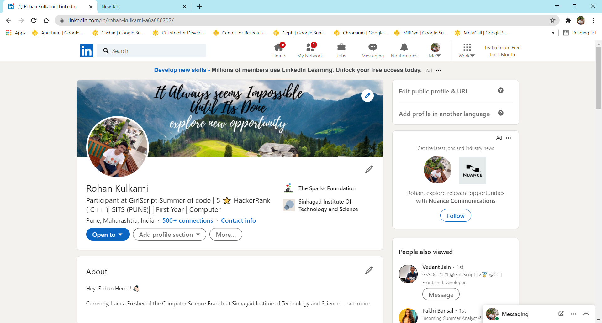
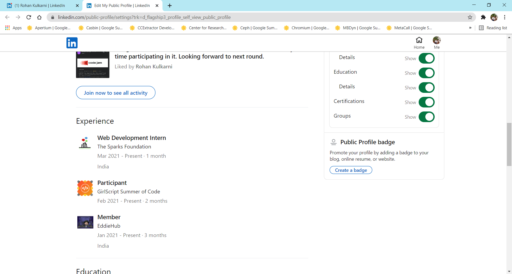
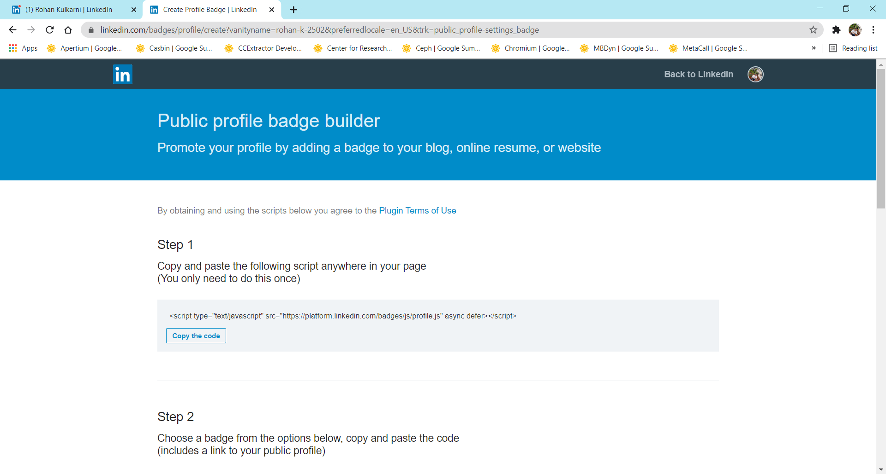
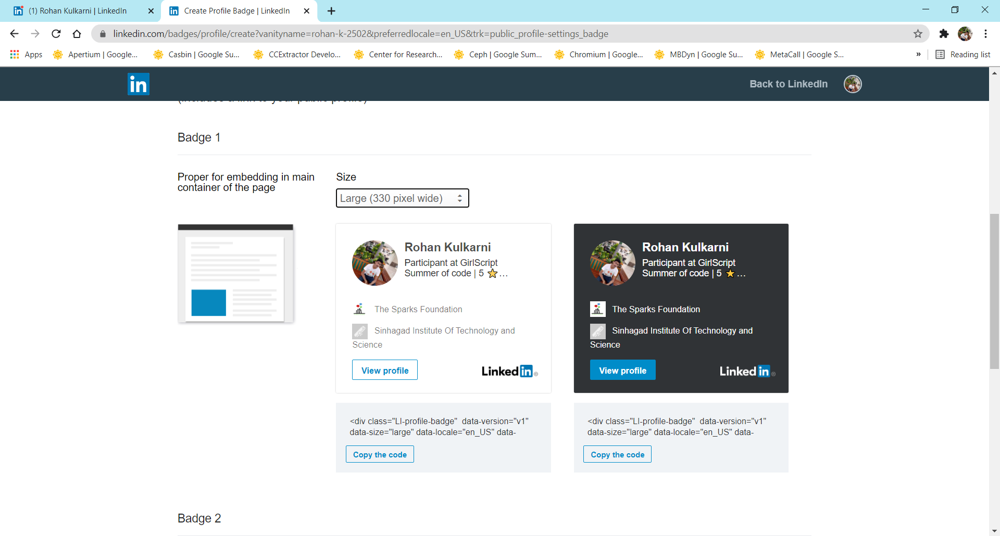

<h1 align="center">EddieHub Members</h1>

<h2>What Exactly is this ?</h2>
<h3>This is an Website which will help everyone of us know each other personally and get connected with each other. Yes there is a dedicated discord server for getting connected but due to timezone issue we dont get connected with all ! So I think this will work out well.
</h3>
 
<h2>What is Required to add Myself in the Website ?</h2>
<h3>To add yourself to the Website You have to Follow some Basic Steps.</h3>
<ul>
<li>LinkedIn Badge URL</li>
<li>GitHub Profile URL</li>
<li>Twitter Profile URL</li>
<li>Gmail Id</li>
</ul>

<h2>Why Only this much ? Why not anything link Instagram / Slack / Mails ?</h2>
<h3>I think that everyone one of us use these Accounts So Its better to go with this. Suggestions Accepted !

<h2>How to get the URl of LinkedIn Badges ?</h2>

### 1.Open LinkedIn Profile Page. 

 

### 2. On Top Right Corner Click on `Edit your custom URL` 

 

### 3. Scroll down to open page and you will get `Public Profile Badge` In right side. 

 

### 4.Now Step 1 I have did you just have to do Step 2 

 

### 5. Go to the section of `Badge 1` and select the `size` to `Large 330 pixel width` Please do not select `Badge 2` because I have adjusted the size as per `Badge 1` 

 

### 6. Select any `Dark` version or `Light` Version of `Badge 1`  

### 7. Copy the Link Given and This is the link for `LinkedIn Badge URL` 

